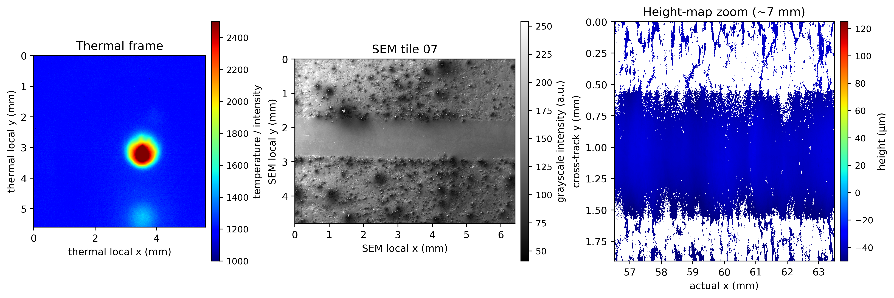

# NSF Future Manufacturing Data Challenge

This repository contains starter code, notebooks, documentation, and paper files for the **NSF Future Manufacturing Data Challenge**.

The raw multimodal dataset is hosted on Zenodo:
**Dataset DOI:** [10.5281/zenodo.21285367](https://doi.org/10.5281/zenodo.21285367)

This competition and associated material are based upon work supported by the National Science Foundation under Grant Number **FMRG-2328395**.

## Dataset overview

The challenge focuses on predicting **probabilistic local geometric variation** of single laser tracks in directed energy deposition (DED) using multimodal data:

- in-situ thermal image sequences,
- SEM images of surrounding substrate morphology,
- Bruker/Wyko full-field height maps.

### Experimental setup


The dataset was generated using an Optomec LENS MTS 500 hybrid manufacturing platform. Post-process characterization was performed using a Bruker ContourGT-K white-light 3D optical profilometer and a Zeiss EVO MA10 SEM system.

### Representative modalities



The thermal frames provide in-situ process information, the SEM tiles provide local substrate-morphology context, and the height maps provide the post-process geometry used to define local track descriptors such as width, boundary position, contour deviation, edge roughness, or related probabilistic targets.

## Repository structure

```text
nsf-fmrg-data-challenge/
├── README.md
├── DATA_USE_LICENSE.md
├── CITATION.cff
├── requirements.txt
├── data/
│   └── raw/
│       ├── thermal/
│       │   └── .gitkeep
│       ├── sem/
│       │   └── .gitkeep
│       └── height_maps/
│           └── .gitkeep
├── notebooks/
│   ├── 01_starter_code_loading_and_visualization.ipynb
│   └── 02_starter_code_loading_and_visualization_standalone_colab.ipynb 
├── src/
│   └── nsf_fmrg_data.py
├── scripts/
│   └── run_thermal_video_export.py
├── experiments/              # one reproducible folder per modeling experiment
├── analysis/                 # team-authored Jupyter analysis notebooks
├── results/
│   ├── figures/              # selected report and presentation plots
│   ├── tables/               # compact metric summaries
│   └── summaries/            # written experiment conclusions
├── docs/
│   ├── project-brief.md      # challenge scope and evaluation priorities
│   └── research-notes/       # dated decisions, observations, and meetings
├── deliverables/
│   ├── report/               # editable report source and final PDF
│   ├── presentation/         # editable slide deck and export
│   └── submission/           # final package checklist and ZIP staging
├── paper/
│   ├── 2607.07965v1.pdf
│   └── figures/
│       ├── experimental_setup_optomec_bruker_zeiss.png
│       └── modality_examples_three_panel.png
└── processed_data/
    └── .gitkeep
```

## Data access

The raw data are hosted externally on Zenodo because the files are too large for regular GitHub upload. After downloading the Zenodo files, extract them into the repository using this layout:

```text
data/raw/thermal/
  Thermal_8.mat
  Thermal_10.mat
  Thermal_14.mat
  Thermal_21.mat

data/raw/sem/
  SEM_8/PlainImages/
  SEM_10/PlainImages/
  SEM_14/PlainImages/
  SEM_21/PlainImages/

data/raw/height_maps/
  Heightmap_8.ASC
  Heightmap_10.ASC
  Heightmap_14.ASC
  Heightmap_21.ASC
```

The `.gitkeep` files are placeholders that keep the empty folders visible on GitHub. They can remain in the folders after the raw data are added locally.

## Challenge task

Given thermal frames, SEM context, and final height maps, participants are asked to predict local geometric variation along the laser track. Candidate targets include:

- local track width,
- left/right boundary position,
- contour deviation,
- edge roughness,
- spatially varying probabilistic descriptors.

The primary expected target is local width variation extracted from the height map. SEM imagery should be used only to characterize surrounding substrate morphology; the processed track region should be masked or excluded to avoid output leakage.

## Physical coordinate conventions

### Thermal data

- File type: `.mat`
- Native frame size: `400 × 400`
- Pixel size: approximately `14 µm/pixel`
- Field of view: approximately `5.6 mm × 5.6 mm`
- Frame rate: `50 fps`
- Scan speed: `10 mm/s`
- Travel per thermal frame: `0.2 mm/frame`
- The 20–100 mm analysis window contains approximately `400` thermal frames.
- Thermal files include frames before laser turn-on and after laser shutoff. The processing notebook detects laser shutoff and extracts the previous 400 frames.

### SEM data

- File type: `.tif`
- Images are stored as per-track tiles in `PlainImages`.
- Tile 01 corresponds to the physical 100 mm side.
- The highest-numbered tile corresponds to the physical 20 mm side.
- The participant starter notebook reads SEM tiles but does not stitch them.
- SEM images should be used to characterize surrounding substrate morphology. Avoid using the processed track region directly as an input feature.

### Bruker/Wyko height maps

- File type: Wyko ASCII `.ASC`
- `x` and `y` values are stored in millimeters.
- `z` values are stored in nanometers and converted to millimeters or micrometers in the code.
- Raw ASC local `x = 0` corresponds to the physical 100 mm side.
- The loader sorts columns so returned height maps increase from 20 mm to 100 mm in actual part coordinates.

## Notebooks

### Organizer/post-processing notebook

Use this notebook to check data, generate figures, extract thermal frames, and export thermal videos:

```text
notebooks/02_starter_code_loading_and_visualization_standalone_colab.ipynb
```

This notebook is fully standalone and does **not** depend on `src/`.

### Participant starter notebook

Use this notebook as the clean starting point for participants:

```text
notebooks/01_starter_code_loading_and_visualization.ipynb
```

This notebook demonstrates:
- thermal loading and 20–100 mm extraction,
- SEM tile loading,
- Bruker/Wyko height-map loading,
- basic physical-coordinate visualization,
- optional display-only tilt inspection.

## Paper

The companion dataset paper PDF is included in:

```text
paper/2607.07965v1.pdf
```

or found here:

```text
https://arxiv.org/abs/2607.07965
```

## Installation

From the repository root:

```bash
python -m pip install -r requirements.txt
```

The notebooks are designed to run in Local System and/or Google Colab. For local use, a standard scientific Python environment with NumPy, SciPy, Matplotlib, Pillow, and Pandas is sufficient.

## Citation

If you use this dataset or code outside the NSF Future Manufacturing Data Challenge, cite the dataset paper, this GitHub repository, and the Zenodo dataset DOI:

```bibtex
@dataset{hanchate2026nsffmrgdedchallengedata,
  title        = {NSF Future Manufacturing Data Challenge: A Multimodal DED Dataset for Probabilistic Local Geometry Prediction in Laser Tracks},
  author       = {Hanchate, Abhishek and Balhara, Himanshu and Bukkapatnam, Satish T. S.},
  year         = {2026},
  publisher    = {Zenodo},
  doi          = {10.5281/zenodo.21285367},
  url          = {https://doi.org/10.5281/zenodo.21285367},
  note         = {Dataset, code, and starter material for the NSF Future Manufacturing Data Challenge}
}
```

and/or 

```bibtex
@misc{hanchate2026nsffmrgdedchallenge,
  title          = {NSF Future Manufacturing Data Challenge: A Multimodal DED Dataset for Probabilistic Local Geometry Prediction in Laser Tracks},
  author         = {Hanchate, Abhishek and Balhara, Himanshu and Bukkapatnam, Satish T. S.},
  year           = {2026},
  eprint         = {2607.07965},
  archivePrefix  = {arXiv},
  primaryClass   = {physics.app-ph},
  url            = {https://arxiv.org/abs/2607.07965},
}
```

## License and data-use terms

See [`DATA_USE_LICENSE.md`](DATA_USE_LICENSE.md).

Challenge use is permitted for registered participants. Any use outside the NSF Future Manufacturing Data Challenge must cite the dataset paper, this repository, and the Zenodo dataset DOI.
